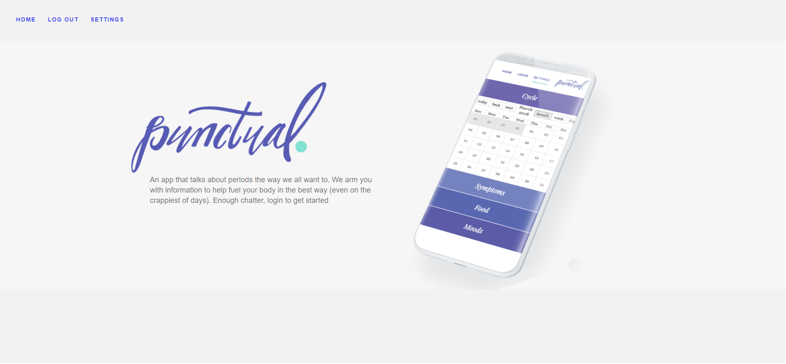
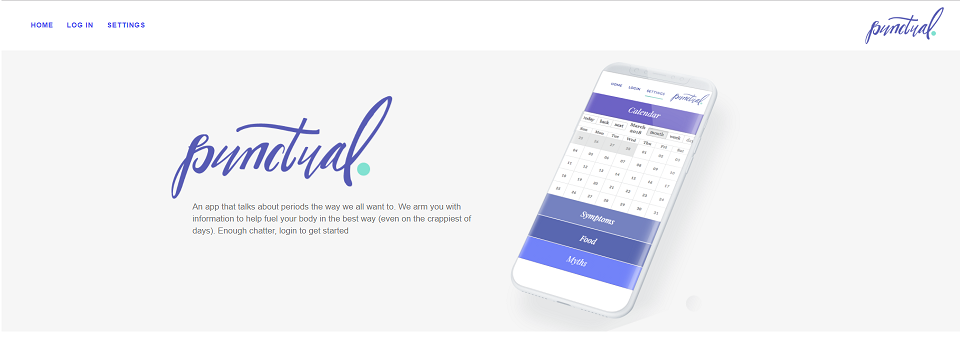
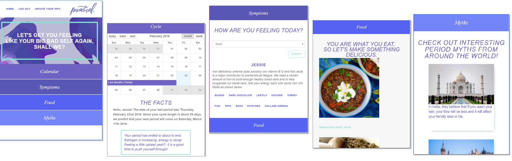

#Punctual

[](https://forthebadge.com)
[](https://forthebadge.com)

<div align="center">
	<br>
</div>

## Description

**Punctual** is web application designed and developed by [Team Punctual](https://github.com/punctual-dot) to simply & honestly track that horrible time of month. The Punctual App also provides recommendations based on your symptoms.

**Punctual is Proud:** There is nothing shameful about periods or people who have them. We're not hiding from this natural process.

**Punctual is Blunt:** No flowery euphemisms or women twirling in A-line skirts in fields of daisies over here; we get to the point.

**Punctual is Trustworthy:** Through extensive research and accurate calculations, you can be sure the information we give you is concise and helpful.

**And, Punctual is Sleek:** No frills, no gimmicks, just beauty in the way you'd want your period app to be "beautiful."

## Motivation for Development

Each one of us found that every month we have challenges with our cycle. We all know to ease our symptoms that we should be eating healthier throughout our cycle. To help with that we wanted to create an easily accessible app that helps with these recommendations.
The app is straightforward and sassier compared to the more delicate and feminine apps that are out there.

## Demo of the app

<a href="http://www.youtube.com/watch?feature=player_embedded&v=YOUTUBE_VIDEO_ID_HERE" target="_blank">
 
</a>

## How to access the app

To start, users log in or register with Punctual using Auth0, an OAuth authentication using JavaScript tokens. Once they're securely in, they are taken to a questionnaire, which will fuel the meat of the app - the tracker itself. A user just enters in relevant information, clicks submit, and we handle the rest.

The app can be accessed [here](https://punctualapp.herokuapp.com) and follow through the steps below to began using the app.

## Screenshots of the app

<div align="center">
	<br><br>
	><br><br>
	<br><br>
	<br>
</div>

## Technology

Our app is a [Express Node](http://expressjs.com) application using [React](https://reactjs.org/) on the front-end, and several mongo databases on the backend. We use [React-Big-Calendar](https://github.com/intljusticemission/react-big-calendar) to track that wonderful time of the month. We also incorporate an API from [Yummly](https://developer.yummly.com/) to serve up recipes based on your symptoms. The app itself is hosted on [Heroku](https://www.heroku.com/).

## Development - Getting Started

To get this app running on your machine you will need to meet the prerequisites, clone the repo and npm install at the Node level and yarn install after you cd into the Client folder.

```
**Prerequisites**
  Installation and development assumes working knowledge of Node.js, API usage in the Node environment, React, and MongoDB. Additionally, it assumes that Node.js, MongoDB database, and React are installed on your machine.
```

## Members of [Team Punctual](https://github.com/punctual-dot):

* Holly Nwangwa - [hnwangwa](https://github.com/hnwangwa)
* Jang Yurai - [jangyjang](https://github.com/jangyjang)
* Jessica Toro-Pacheco - [jessicatoro2](https://github.com/jessicatoro2)
* Mhirra Yung - [lookatdmoon](https://github.com/lookatdmoon)

Thank you for visiting!!
